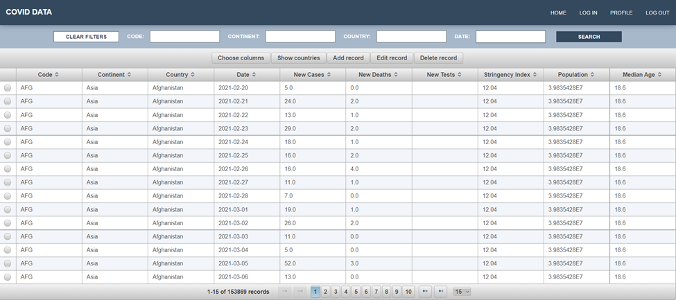

# Covid Data Web Processor

## Overview

Covid Data Web Processor offers a comprehensive solution for accessing and managing Covid-19 data. Born out of the need
for a seamless interface to interact with the extensive Covid data, this tool not only provides visualization and filtering capabilities but also enables authorized modifications.
Whether you're a researcher looking for specific data sets, an administrator aiming to curate the data, or a general
user keen on understanding the current Covid statistics, the platform provides an intuitive way to navigate
this information.

## Features

- **Guest Access**: Allows guests to view and filter the stored data.
- **User Access**: Registered users can add, modify, or remove records, as well as country data.
- **Public API**: Provides a RESTful endpoint for accessing the data.

## Technical Specifications

- **Framework**: Java EE with JSF.
- **Database**: JPA for connectivity, utilizing Oracle SQL.
- **Server**: Tomcat.
- **Design Patterns**:
    - **MVC (Model-View-Controller)**: Structuring the code to separate concerns.
    - **DAO (Data Access Object)**: An abstract interface to the database that masks the details of data access.

## Getting Started

1. **Data Migration**:
    - The application includes a converter to migrate data from CSV format to the Oracle SQL database, available in
      the [DBPopulator](https://github.com/anakalemi/Covid-Data-Processor/blob/master/src/main/java/com/covidstats/data/DBPopulator.java)
      java file.
    - Prior to data migration, run
      the [SQL script](https://github.com/anakalemi/Covid-Data-Processor/blob/master/src/main/resources/create-tables.sql)
      to set up the necessary database tables.

2. **Credentials**:
    - To leverage the full functionalities as an authorized user:
        - **Email**: anakalemi@unyt.edu.al
        - **Password**: 1

## Prerequisites

Ensure you have the following dependencies installed:

- Java SE 8 or newer.
- JSF 2.5.
- Primefaces 8.0.
- Tomcat 8.5.75. 
- Oracle SQL 7.0.

## Acknowledgments 

The Covid dataset is sourced from:
Mathieu, E., Ritchie, H., Ortiz-Ospina, E. et al. "A global database of COVID-19 vaccinations." Nat Hum Behav (
2021). [Link to the Study](https://doi.org/10.1038/s41562-021-01122-8).

## Preview

  

---
